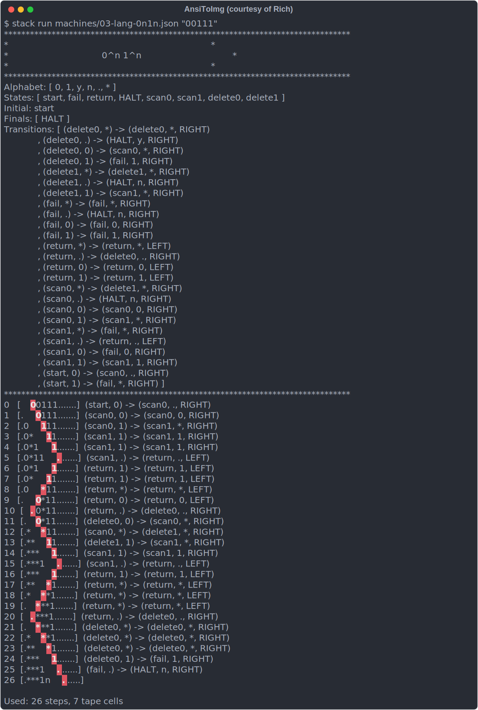

# `ft_turing` – a Turing Machine simulator written in Haskell

* A student project implementing a single-headed, singly-infinite-tape Turing machine in Haskell
* The goal is to
    * parse a machine description ([example](machines/00-unary_sub.json))
    * validate it
    * run the machine and log all transitions
* For complete instructions please refer to [docs](https://github.com/fpetras/42-subjects/blob/master/ft_turing.en.pdf)

## Usage

To use the machine you need to have installed [Stack](https://docs.haskellstack.org/en/stable/install_and_upgrade/). You can then run

```sh
$ stack run <machine> <input>
```
where
- `machine` is a file describing the machine
- `input` is a string of symbols, representing initial tape contents.

## Machines

A few machines capable of executing simple programs can be found in `machines/`:

<details>
<summary><code>00-unary_sub</code> – performs unary subtraction.</summary>
</br>
</details>

<details>
<summary><code>01-unary_add</code> – performs unary addition.</summary>
</br>
</details>

<details>
<summary><code>02-palindrome</code> – checks if the input is a palindrome.</summary>
</br>
</details>

<details>
<summary><code>03-lang-0n1n</code> – checks if the input is a word in the language </summary>
</br>
</details>

<details>
<summary><code>04-lang-02n</code> – checks if the input is a word in the language </summary>
</br></br>
</details>

## Acknowledgements

I'm grateful to the entire team behind [School 21](https://21-school.ru) for the opportunity to do these interesting projects. I also thank

* [Denis Moskvin](https://www.hse.ru/en/org/persons/223602533) for a superb course on functional programming using Haskell
* [Léonard Marques](https://github.com/keuhdall) for putting a [similar project](https://github.com/keuhdall/ft_turing) in the public domain; it helped me clarify some important points.
* creators of [AnsiToImg](https://github.com/FHPythonUtils/AnsiToImg) – a tool for converting ANSI terminal output to pretty images

